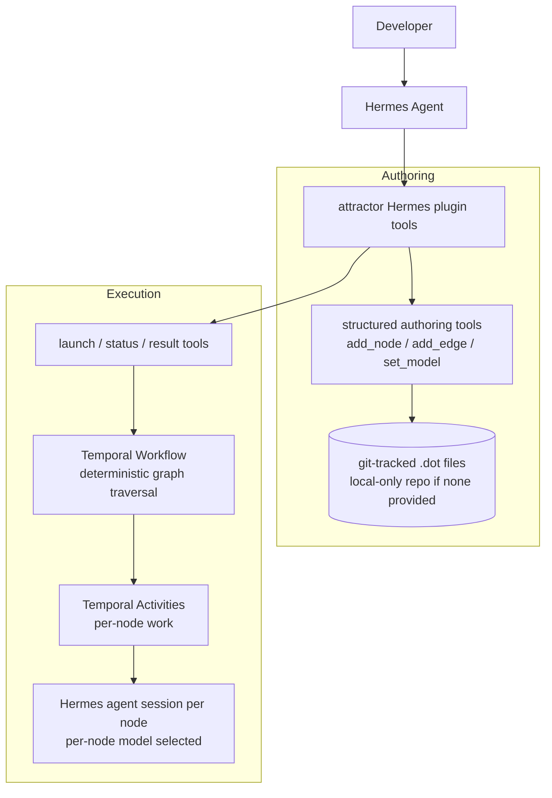

# Attractor as a Hermes Plugin on Temporal

> **Update (2026-05-28, during /sp:02-specify):** Two decisions below were superseded after
> learning the Hermes constraints. (1) Plugins **cannot** spawn agent sub-sessions, but the
> **Hermes Kanban board** can run agent work — so node execution is via kanban cards
> assigned to profiles, not in-process sessions. (2) The kanban board already provides
> durable, retrying, dependency-aware, human-in-the-loop execution, making **Temporal
> redundant** — it has been **dropped**; the plugin is a deterministic traversal engine
> (reducer over kanban completion events). (3) Per-node *model* selection is expressed as
> per-node *profile* selection. The authoritative, current requirements live in
> `specs/001-attractor-kanban/spec.md`. This doc is retained as historical context.

## Problem Frame

Teams building multi-stage AI/agent pipelines need a way to **declare** a workflow
as a graph (not imperative glue code), **run** it durably (surviving crashes and
restarts), and **steer model choice per stage** (cheap models for routing, strong
models for hard work). StrongDM's *Attractor* defines exactly this as a spec — a
DOT/Graphviz graph of nodes traversed by a deterministic engine that invokes
agentic work per node — but ships no implementation, and its native durability is
hand-rolled.

This effort implements Attractor's semantics as a **Hermes agent plugin** whose
headline value is **authoring and versioning** workflows, with **durable execution
on Temporal** as the secondary-but-real capability. Each LLM node runs via a
**Hermes agent session**, and the per-node model selects which model that session
uses. The affected user is a developer (operating through a Hermes agent) who
composes, validates, versions, and runs AI pipelines.

## Architecture

Prose is authoritative where it disagrees with the diagram.

## Requirements

**Authoring & Versioning**

- R1. The plugin SHALL let a Hermes agent author Attractor workflows via structured
  tools (create graph, add/remove node, add/remove edge, set node/edge attributes,
  set per-node model) rather than by hand-writing DOT text.
- R2. Graphviz **DOT** SHALL be the canonical, portable, stored representation; the
  structured tools emit and patch DOT.
- R3. Workflows SHALL be stored as **git-tracked `.dot` files** in a repo the agent
  can access; versioning is via git. If no external repo is provided, the plugin
  SHALL operate on a **local-only repo it initializes**.
- R4. The plugin SHALL **validate** a workflow against structural and Attractor rules
  (exactly one start `Mdiamond` and one exit `Msquare`, node/edge legality,
  reachability, goal-gate sanity) and return actionable errors.
- R5. The plugin SHALL produce a human-readable **visualization/summary** of a
  workflow's structure.

**Attractor Workflow Semantics**

- R6. Node handlers SHALL be selected by shape per Attractor: start (`Mdiamond`),
  exit (`Msquare`), codergen LLM (`box`), conditional (`diamond`), tool
  (`parallelogram`), parallel fan-out (`component`), parallel fan-in
  (`tripleoctagon`), human-in-the-loop (`hexagon`).
- R7. Edge selection SHALL be **deterministic by priority**: condition match →
  preferred label → suggested next ids → highest `weight` → lexical tiebreak.
- R8. A shared **context** SHALL be threaded through stages; handlers return context
  updates.
- R9. **Goal gates**: nodes marked `goal_gate` MUST reach success/partial-success
  before the pipeline may exit; otherwise traversal routes to a retry target.
- R10. **Parallel fan-out/fan-in** SHALL run independent branches concurrently with
  defined context clone-and-merge semantics.
- R11. **Conditional** nodes SHALL route based on context guards.
- R12. **Tool** nodes SHALL invoke deterministic (non-LLM) work as a graph stage.
- R13. **Human-in-the-loop** nodes SHALL pause for human input and later resume.

**Execution & Durability (Temporal)**

- R14. Graph traversal SHALL run as a **Temporal Workflow** (deterministic); per-node
  work SHALL run as **Temporal Activities** (non-deterministic).
- R15. Temporal SHALL provide durability, retries, and crash recovery, **replacing
  Attractor's native checkpoint/backoff machinery**.
- R16. Per-node `max_retries` / retry intent SHALL map to a Temporal retry policy.
- R17. Human-in-the-loop pauses (R13) SHALL be implemented via **Temporal signals**;
  a waiting pipeline SHALL survive worker restarts.
- R18. The agent SHALL be able to **launch** a run, **check status**, and **retrieve
  results/outcome**.

**Model Selection**

- R19. Per-node model selection SHALL be supported via node attributes (model,
  provider, reasoning effort).
- R20. A graph-level **`model_stylesheet`** with CSS-like selectors
  (universal/shape/class/id) and specificity precedence SHALL set model defaults;
  per-node attributes override stylesheet defaults.

**Node Execution Backend**

- R21. Codergen (and other LLM) nodes SHALL execute via a **Hermes agent session**;
  the per-node model (R19/R20) determines which model that session runs.
- R22. Node prompts SHALL support variable expansion (e.g. `$goal`) from context.

**Plugin Integration**

- R23. The capability SHALL be delivered as a **Hermes agent plugin** registering the
  authoring and execution tools; handlers return JSON and never raise (per repo
  `plugin/tools.py` contract).

## Success Criteria

- From natural language, a Hermes agent authors a multi-node workflow (including a
  branch and a goal gate), it validates clean, and it lands as a git-tracked `.dot`
  file.
- That workflow runs durably on Temporal; **killing and restarting the worker
  mid-run resumes without re-executing completed nodes**.
- A workflow using `model_stylesheet` plus one per-node override demonstrably routes
  different nodes to **different models**.
- A human-in-the-loop node pauses a run that later **resumes via a signal** after a
  restart.
- A fan-out/fan-in workflow runs branches **concurrently** and merges context.

## Scope Boundaries

Deferred to a post-v1 roadmap (deliberate non-goals now):

- Attractor's **coding-agent inner-loop** spec beyond what a Hermes agent session
  already provides (mid-task steering, loop detection, history truncation).
- Pluggable **execution environments** (Docker / Kubernetes / WASM / RemoteSSH).
- **Context fidelity modes** (full / compact / summary:*) tuning beyond a sane default.
- **`manager_loop`** (`house`) supervisor node.
- A **direct (non-Hermes) LLM client** backend.
- A standalone **CLI or GUI** — the interface is the Hermes plugin.
- A **plugin-managed workflow registry** — git-tracked `.dot` files only.

## Key Decisions

- **Temporal replaces Attractor's native durability** — graph traversal is a
  deterministic Workflow; node work is Activities. (Rationale: Attractor's
  checkpoint/retry semantics map cleanly onto Temporal's event-history replay, which
  is battle-tested and removes hand-rolled state machinery.)
- **Nodes execute via Hermes agent sessions**, not a direct LLM client. (Rationale:
  user wants nodes to be first-class Hermes agents; per-node model = that session's
  model.)
- **DOT is canonical, authored via structured tools.** (Rationale: faithful to
  Attractor and git-versionable, but LLMs hand-editing DOT is error-prone; structured
  tools + validation make authoring reliable.)
- **Git-tracked `.dot` files with a local-only repo fallback.** (Rationale: workflows
  as code; transparent versioning; zero external dependency to start.)
- **Full Attractor feature set targeted for v1**, but built as a **thin vertical slice
  first** (author → validate → run a linear graph with per-node models on Temporal),
  then widened to stylesheet, parallel, human-in-the-loop, and tool nodes.

## Dependencies / Assumptions

- **Hermes runtime is not yet installed.** It is assumed Hermes can spawn/run an
  agent session programmatically with a caller-chosen model — this gates R21 and is
  unverified.
- Research indicates the real plugin entry-point group is **`hermes_agent.plugins`**
  (the repo's CLAUDE.md / `pyproject.toml` currently assume `hermes.plugins`) —
  reconcile during planning.
- A **Temporal** cluster or dev server plus a Python worker (`temporalio`) is
  available in the target deployment.
- A **Graphviz** renderer (or pure-Python equivalent) is available for R5.

## Outstanding Questions

### Resolve Before Specify

- _(none — major product forks are resolved.)_

### Deferred to Planning

- [Affects R21][Needs research] Can a Hermes agent session be spawned/driven from
  inside a Temporal Activity (process model, auth, concurrency, isolation)? This is
  the load-bearing feasibility question.
- [Affects R23][Technical] Exact Hermes plugin registration API and the
  `hermes_agent.plugins` vs `hermes.plugins` entry-point reconciliation.
- [Affects R19/R20][Technical] The model-identifier catalog Hermes exposes and how
  `reasoning_effort` maps to Hermes/provider params.
- [Affects R13/R17][Technical] Human-in-the-loop surface: how the human is prompted
  and how their response reaches the Temporal signal (via the Hermes agent? an
  external channel?).
- [Affects R10][Technical] Context clone/merge conflict-resolution rules for parallel
  fan-in.
- [Affects R14/R15][Technical] Temporal runtime ownership (dev server vs hosted) and
  worker lifecycle/deployment.
- [Affects R6–R9][Needs research] Verify exact Attractor spec identifiers (attribute
  names, status enums, fidelity strings) against the raw NLSpec markdown before
  encoding.
- [Affects Success Criteria][Product] Pick a concrete reference workflow/domain
  example to anchor acceptance (can be decided in specify).

## Next Steps

- `-> /sp:02-specify` to create the formal specification.
